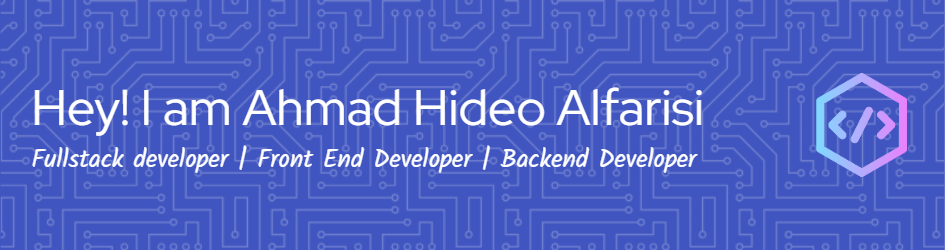

  

  

---

### 🚀 About Me

Hi! I'm **Ahmad Hideo**, a Computer Engineering student with a strong interest in tech and innovation.  
I love bringing ideas to life through **web development**, from frontend design to backend logic.  
Currently, I'm exploring the world of **full-stack development**, working with modern tools, and constantly learning to improve my craft.  
I'm passionate about clean code, good UI/UX, and building things that matter.

---

### 🛠 Tech Stack

Here are some technologies I've worked with:

  
  
  
  
  
  
  
  
  
  
  
  
  
  
  
  
  

---

### 🌐 Connect with Me

  
  
  
  

---

### 🎧 Currently Listening on Spotify

  

---

### 🧠 Contribution Activity

<picture>
  <source media="(prefers-color-scheme: dark)" srcset="https://raw.githubusercontent.com/hideoahmad/hideoahmad/output/pacman-contribution-graph-dark.svg">
  <source media="(prefers-color-scheme: light)" srcset="https://raw.githubusercontent.com/hideoahmad/hideoahmad/output/pacman-contribution-graph.svg">
  
</picture>

---

  

